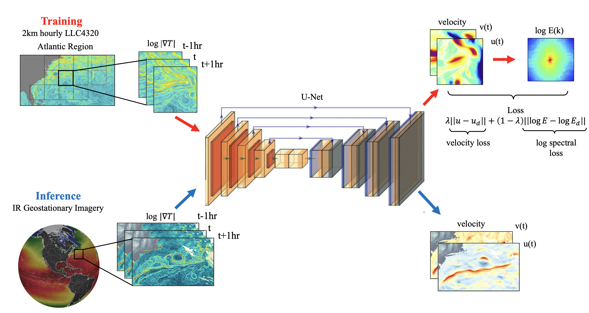

# GOFLOW: Geostationary Ocean Flow

Deep learning framework for predicting ocean surface velocity fields from satellite sea surface temperature (SST) gradient observations.

## Overview

GOFLOW trains neural networks to infer ocean flow dynamics (U, V velocity components) from thermal gradient patterns observed in satellite imagery. The approach leverages the physical relationship between SST gradients and surface currents to enable velocity estimation from widely available satellite observations.

**Key Features:**
- Multiple neural network architectures (UNet, ConvNeXt-style, lightweight CNN)
- Hybrid loss functions combining L1, spectral, and gradient-based losses
- Two-stage training workflow for improved spectral characteristics
- Inference pipeline for GOES satellite brightness temperature data

## Inferred velocity gradients from GOES satellite data


## Installation

### Requirements

- Python 3.8+
- PyTorch 1.10+
- NumPy
- SciPy
- scikit-learn
- netCDF4
- tqdm

```bash
pip install torch numpy scipy scikit-learn netCDF4 tqdm
```

## Quick Start

### Training

```bash
# Basic UNet training (Stage 0: L1 loss only)
python train_goflow.py --cuda 0 --model unet --nbase 16 --c_spec 0.0 --epochs 100

# Stage 1: Fine-tune with spectral loss
python train_goflow.py --cuda 0 --model unet --nbase 16 --c_spec 0.5 --epochs 50

# Use gradient loss (vorticity/strain) instead of spectral loss
python train_goflow.py --cuda 0 --model unet --c_spec 0.5 --use_grad_loss
```

### Inference

```bash
# Run inference on GOES satellite data
python inf_llc_stage1.py --model_file lgt_unet16_1_3_0.5cs.pth --goes_files satellite_data.nc

# With input normalization (if model was trained with it)
python inf_llc_stage1.py --model_file model.pth --inp_norm --goes_files data.nc
```

## Architecture

### Data Flow

```
Input: SST gradients (3 temporal frames) [B, 3, H, W]
    ↓
Neural Network (UNet / SamudraUNet / TwoLayerCNN)
    ↓
Output: Velocity field (U, V) [B, 2, H, W]
    ↓
Derived fields: vorticity, divergence, strain
    ↓
Evaluation: R² on velocities and derived fields
```

### Model Architectures

| Model | Description | Use Case |
|-------|-------------|----------|
| `unet` | Classical U-Net encoder-decoder with skip connections | Default, best accuracy |
| `samudra0` | ConvNeXt-based U-Net with zero padding | Alternative architecture |
| `samudraR` | ConvNeXt-based U-Net with reflect padding | Reduced edge artifacts |
| `2layer` | Lightweight 2-layer CNN | Fast baseline |

### Loss Functions

The training uses a configurable hybrid loss:

```
Loss = (1 - c_spec) × L1_loss + c_spec × auxiliary_loss
```

Where `auxiliary_loss` is either:
- **Spectral Loss**: MSE in log-space of 2D FFT kinetic energy spectrum
- **Gradient Loss**: Vorticity and strain magnitude constraints

## Training Arguments

| Argument | Default | Description |
|----------|---------|-------------|
| `--cuda` | 0 | CUDA device index |
| `--model` | unet | Architecture: unet, samudra0, samudraR, 2layer |
| `--nbase` | 16 | Base channel count (model size scales with this) |
| `--c_spec` | 0.0 | Spectral/gradient loss weight (0-1) |
| `--use_grad_loss` | False | Use gradient loss instead of spectral |
| `--epochs` | 100 | Number of training epochs |
| `--lr` | 0.001 | Initial learning rate |
| `--tcycle` | 5 | Cosine annealing cycle length |
| `--nframes` | 3 | Number of input SST frames |
| `--step0` | 1 | Time step stride between frames |

## Inference Arguments

| Argument | Default | Description |
|----------|---------|-------------|
| `--model_file` | Required | Path to trained model checkpoint |
| `--goes_files` | - | GOES satellite data files to process |
| `--nbase` | 16 | Base channels (must match training) |
| `--inp_norm` | False | Enable input normalization |
| `--blend_alpha` | 0.5 | Test result blending factor |
| `--skip_test` | False | Skip test set evaluation |
| `--skip_satellite` | False | Skip satellite data processing |

## Project Structure

```
goflow/
├── train_goflow.py      # Main training script
├── inf_llc_stage1.py    # Inference pipeline
├── goflow_core.py       # Core utilities (gradients, losses, data loading)
├── dataSST.py           # Dataset classes for LLC and satellite data
├── spectral_loss.py     # Spectral domain loss functions
├── utils.py             # Training utilities (LR scheduling, checkpointing)
├── unet_vel_bn.py       # UNet architecture
├── samudraUnet.py       # ConvNeXt-style UNet
├── simpleCNN.py         # Lightweight CNN baseline
├── unet_parts_t.py      # UNet building blocks
└── writenc.py           # NetCDF output utilities
```

## Data Format

### Training Data (LLC)

NetCDF file with variables:
- `loggrad_T`: Log SST gradient field `[time, y, x]`
- `U`: Zonal velocity `[time, y, x]`
- `V`: Meridional velocity `[time, y, x]`

### Satellite Data (GOES)

NetCDF file with:
- `BT_gradient`: Brightness temperature gradient `[time, y, x]`

### Normalization

- SST gradient (`loggrad_T`): Range [-19, 0] normalized to [0, 1]
- SST: Range [0, 30°C] normalized to [0, 1]

## Two-Stage Training Workflow

For best results, we recommend a two-stage training approach:

1. **Stage 0**: Train with pure L1 loss (`c_spec=0.0`) for ~100 epochs
   - Learns basic velocity patterns
   - Fast convergence

2. **Stage 1**: Fine-tune with spectral loss (`c_spec=0.5`) for ~50 epochs
   - Improves spectral characteristics
   - Better small-scale structure

```bash
# Stage 0
python train_goflow.py --cuda 0 --model unet --nbase 16 --c_spec 0.0 --epochs 100

# Stage 1 (loads best model from Stage 0)
python train_goflow.py --cuda 0 --model unet --nbase 16 --c_spec 0.5 --epochs 50
```

## Model Checkpoints

Models are saved with the naming convention:
```
lgt_<model><nbase>_<step0>_<nframes>_<c_spec>cs.pth
```

Example: `lgt_unet16_1_3_0.5cs.pth`

## Citation

If you use GOFLOW in your research, please cite:

```bibtex
@article{lenain2026unprecedented,
  title={An unprecedented view of ocean currents from geostationary satellites},
  author={Lenain, Luc and Srinivasan, Kaushik and Barkan, Roy and Pizzo, Nick},
  journal={Nature Geosciences},
  year={2026},
  note={in press}
}
```

## License

[Add your license here]

## Acknowledgments

- UCLA Atmospheric and Oceanic Sciences Department
- GOES satellite data providers
